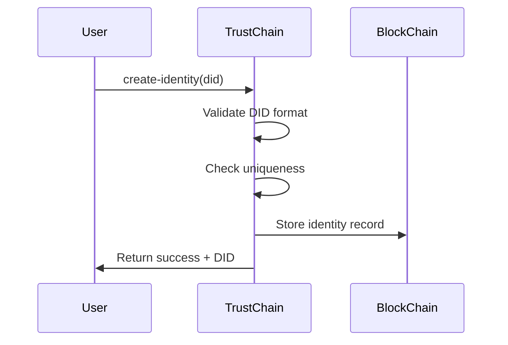
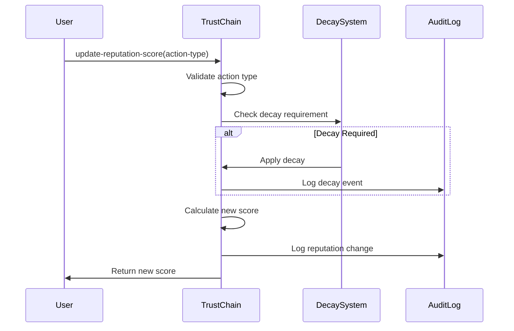

# TrustChain - Dynamic Reputation Protocol

## Overview

TrustChain is a sophisticated, blockchain-native reputation system built on the Stacks blockchain that creates a living trust score evolving with user behavior. Unlike static reputation systems, TrustChain implements intelligent decay mechanics and multi-dimensional scoring to prevent reputation farming while rewarding consistent participation.

## Key Features

- **Adaptive Scoring Engine**: Multi-dimensional reputation calculation based on diverse on-chain activities
- **Temporal Intelligence**: Sophisticated decay algorithms that maintain score relevance over time
- **Enterprise-Grade Verification**: Comprehensive identity management with DID integration
- **Governance & Flexibility**: Administrative controls for ecosystem adaptation
- **Immutable Audit Trails**: Complete tracking of all reputation modifications

## System Architecture

### Core Components

```
┌─────────────────────────────────────────────────────────────┐
│                    TrustChain Protocol                      │
├─────────────────────────────────────────────────────────────┤
│  Identity Management  │  Reputation Engine  │  Governance   │
│  ┌─────────────────┐  │  ┌───────────────┐  │  ┌─────────┐  │
│  │ DID Registry    │  │  │ Scoring Logic │  │  │ Admin   │  │
│  │ Status Tracking │  │  │ Action Types  │  │  │ Controls│  │
│  │ Validation      │  │  │ Multipliers   │  │  │ Config  │  │
│  └─────────────────┘  │  └───────────────┘  │  └─────────┘  │
├─────────────────────────────────────────────────────────────┤
│                    Decay System                             │
│  ┌─────────────────┐  │  ┌───────────────┐                 │
│  │ Time-based      │  │  │ Automated     │                 │
│  │ Decay Logic     │  │  │ Score Updates │                 │
│  └─────────────────┘  │  └───────────────┘                 │
├─────────────────────────────────────────────────────────────┤
│                    Audit & History                         │
│  ┌─────────────────┐  │  ┌───────────────┐                 │
│  │ Reputation      │  │  │ Immutable     │                 │
│  │ Change Log      │  │  │ History Trail │                 │
│  └─────────────────┘  │  └───────────────┘                 │
└─────────────────────────────────────────────────────────────┘
```

### Data Structures

#### Identity Registry

```clarity
{
  did: string-ascii 50,           // Decentralized Identity
  reputation-score: uint,         // Current reputation score (0-1000)
  created-at: uint,              // Block height of creation
  last-updated: uint,            // Last modification block
  last-decay: uint,              // Last decay application block
  total-actions: uint,           // Total actions performed
  active: bool                   // Identity status
}
```

#### Reputation Actions

```clarity
{
  multiplier: uint,              // Score impact multiplier
  description: string-ascii 100, // Action description
  active: bool                   // Action availability
}
```

#### Audit History

```clarity
{
  action-type: string-ascii 50,  // Type of action performed
  previous-score: uint,          // Score before change
  new-score: uint,              // Score after change
  timestamp: uint,              // Burn block height
  block-height: uint            // Stacks block height
}
```

## Contract Architecture

### Administrative Layer

- **Contract Owner Management**: Secure ownership transfer mechanisms
- **Protocol Configuration**: Dynamic parameter adjustment capabilities
- **Action Type Management**: Extensible reputation action framework

### Identity Management Layer

- **DID Integration**: Decentralized identity registration and validation
- **Status Control**: Active/inactive identity state management
- **Reputation Initialization**: Configurable starting reputation values

### Scoring Engine

- **Multi-dimensional Calculation**: Considers various action types with different weights
- **Boundary Management**: Enforces min/max reputation limits (0-1000)
- **Real-time Updates**: Immediate score adjustments upon action completion

### Decay System

- **Time-based Degradation**: Automatic score reduction over time
- **Configurable Parameters**: Adjustable decay rates and periods
- **Freshness Maintenance**: Prevents stale reputation abuse

## Data Flow

### Identity Creation Flow



### Reputation Update Flow



## Configuration Parameters

| Parameter | Default Value | Description |
|-----------|---------------|-------------|
| `MAX-REPUTATION-SCORE` | 1000 | Maximum achievable reputation |
| `MIN-REPUTATION-SCORE` | 0 | Minimum reputation floor |
| `DEFAULT-STARTING-REPUTATION` | 50 | Initial reputation for new identities |
| `DEFAULT-DECAY-RATE` | 10% | Percentage decay per period |
| `MINIMUM_DID_LENGTH` | 5 | Minimum DID string length |

## Default Reputation Actions

| Action Type | Multiplier | Description |
|-------------|------------|-------------|
| `governance-vote` | 5 | Participation in governance voting |
| `contract-fulfillment` | 10 | Successful smart contract completion |
| `community-contribution` | 7 | Community project contributions |
| `validation` | 3 | Network transaction validation |
| `content-creation` | 6 | Valuable content creation |

## API Reference

### Administrative Functions

#### `set-contract-owner(new-owner: principal)`

Transfer contract ownership to a new principal.

#### `set-contract-active(active: bool)`

Enable or disable the contract functionality.

#### `set-decay-parameters(new-rate: uint, new-period: uint)`

Configure decay rate (percentage) and period (blocks).

#### `add-reputation-action(action-type: string-ascii, multiplier: uint, description: string-ascii)`

Add a new reputation action type with specified multiplier.

### Identity Management

#### `create-identity(did: string-ascii)`

Create a new identity with DID registration.

#### `update-identity-status(active: bool)`

Update the active status of the caller's identity.

### Reputation Functions

#### `update-reputation-score(action-type: string-ascii)`

Update reputation based on performed action type.

#### `decay-reputation()`

Manually trigger reputation decay for the caller.

### Query Functions

#### `get-reputation(owner: principal)`

Retrieve current reputation score for a principal.

#### `get-full-identity(owner: principal)`

Get complete identity information including metadata.

#### `verify-reputation(owner: principal, min-threshold: uint)`

Verify if a principal meets minimum reputation threshold.

#### `get-contract-parameters()`

Retrieve current protocol configuration parameters.

## Error Codes

| Code | Constant | Description |
|------|----------|-------------|
| 100 | `ERR-UNAUTHORIZED` | Unauthorized access attempt |
| 101 | `ERR-INVALID-PARAMETERS` | Invalid function parameters |
| 102 | `ERR-IDENTITY-EXISTS` | Identity already exists |
| 103 | `ERR-IDENTITY-NOT-FOUND` | Identity not found |
| 104 | `ERR-INSUFFICIENT-REPUTATION` | Insufficient reputation |
| 105 | `ERR-MAX-REPUTATION-REACHED` | Maximum reputation reached |
| 106 | `ERR-ACTION-EXISTS` | Action type already exists |
| 107 | `ERR-ACTION-NOT-FOUND` | Action type not found |
| 108 | `ERR-NOT-ADMIN` | Admin privileges required |
| 109 | `ERR-NOT-ACTIVE` | Contract or identity not active |

## Use Cases

### DeFi Protocols

- Lending/borrowing risk assessment
- Liquidity provider credibility
- Governance participation weighting

### Marketplace Applications

- Seller/buyer trust verification
- Transaction risk evaluation
- Dispute resolution context

### Governance Systems

- Voting weight determination
- Proposal submission requirements
- Community leadership selection

### Content Platforms

- Creator credibility assessment
- Moderation decision context
- Content quality indicators

## Integration Example

```javascript
// JavaScript integration example
const reputation = await callReadOnlyFunction({
  contractAddress: 'SP...',
  contractName: 'trustchain',
  functionName: 'get-reputation',
  functionArgs: [standardPrincipalCV(userAddress)]
});

if (reputation.type === 'ok' && reputation.value > 100) {
  // Grant access to premium features
}
```

## Security Considerations

- **Identity Verification**: Proper DID validation prevents identity spoofing
- **Decay Mechanism**: Time-based decay prevents reputation hoarding
- **Admin Controls**: Centralized admin functions require careful key management
- **Action Validation**: Only active, registered actions can affect reputation
- **Audit Trail**: Complete history enables forensic analysis

## Deployment

1. Deploy the contract to Stacks blockchain
2. Initialize reputation actions using `initialize-reputation-actions`
3. Configure decay parameters as needed
4. Set up monitoring for reputation changes
5. Integrate with dApps using read-only functions

## Contributing

This protocol is designed to be extensible and adaptable to various use cases. Contributions should focus on:

- Additional action types for specific domains
- Enhanced decay algorithms
- Integration examples
- Security improvements

## License

This smart contract is provided as-is for educational and development purposes. Ensure proper testing and auditing before production deployment.
